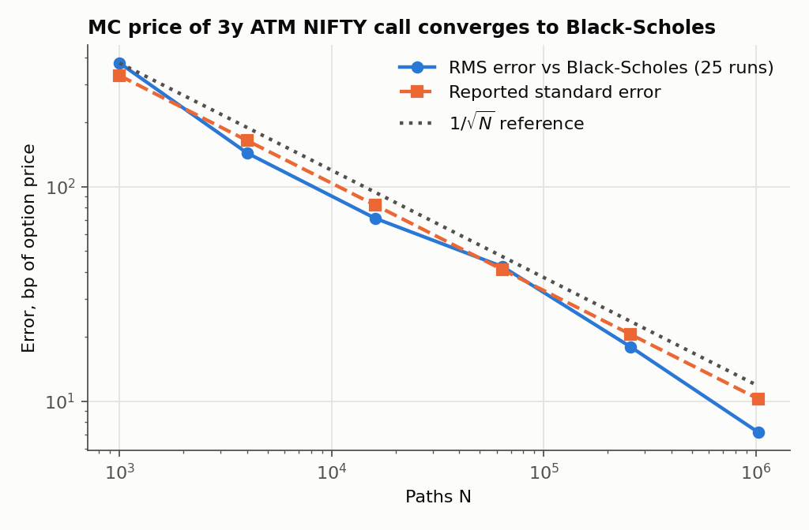
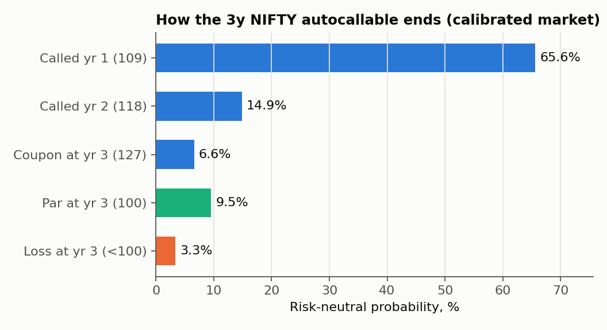
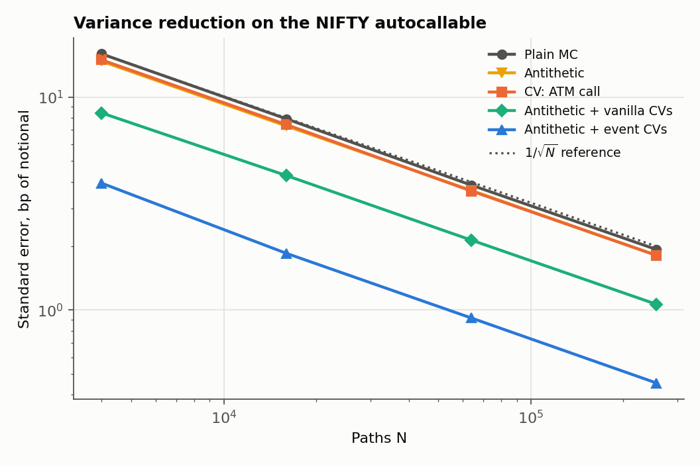
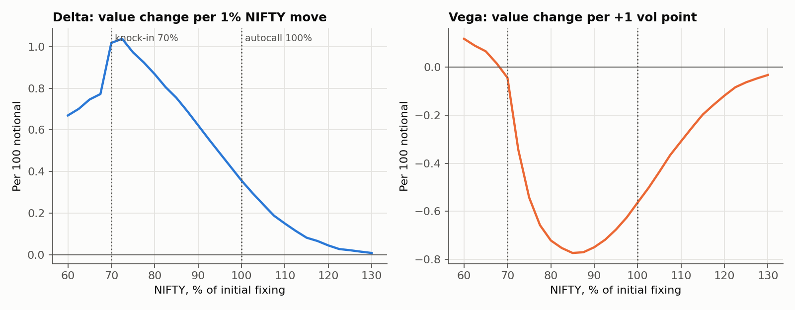
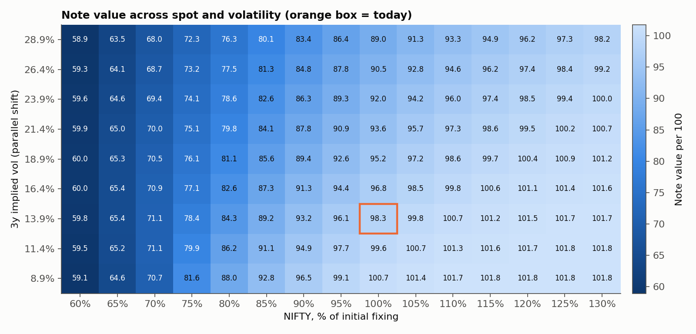
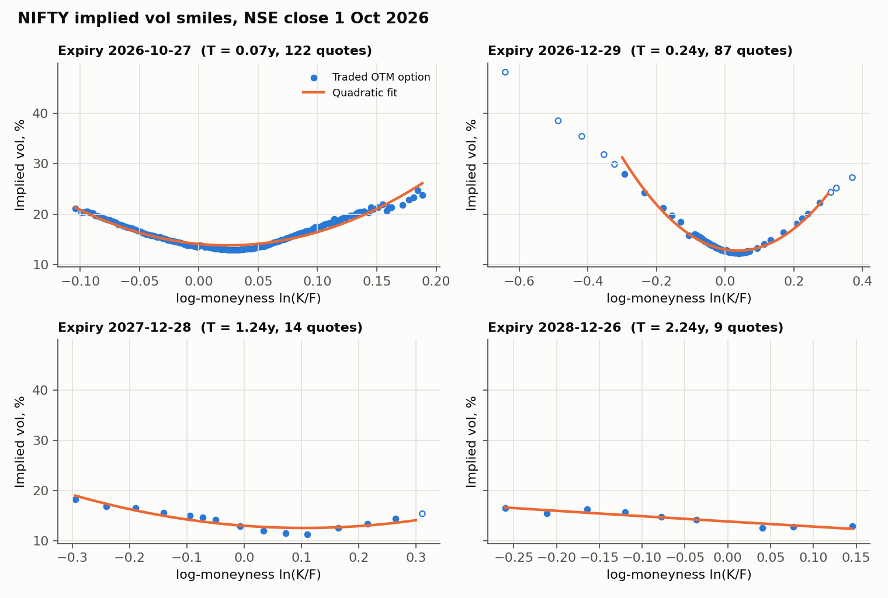

# Nifty 50 autocallable MLD pricer

A Monte Carlo pricer for a market-linked debenture on the NIFTY 50: a 3-year
autocallable note with a knock-in barrier, the kind of structure Indian NBFCs
issue to retail and institutional investors. It is calibrated to the NSE option
chain for 1 October 2026 and validated against QuantLib and against a
closed form derived for the final-fixing variant of the note.

## The product

| Term | Base case |
|---|---|
| Underlying | NIFTY 50, initial fixing 22,421.95 (NSE close, 1 Oct 2026) |
| Tenor | 3 years, annual observations |
| Autocall | Redeems early at 100 x (1 + 9% x years elapsed) if NIFTY >= 100% of initial |
| At maturity, not called | 127 if NIFTY >= 100%; else 100 if the barrier was never hit; else 100 x NIFTY / initial |
| Knock-in barrier | 70% of initial, checked on daily closes |
| Issuer credit | Cash flows discounted at the INR curve + 100bp |

The note decomposes into a zero-coupon bond (79.97 per 100) and a derivative
overlay (+18.36): a strip of digital calls that pay the coupons, minus a
down-and-in put that the investor is short.

## Headline results

| | |
|---|---|
| Fair value per 100 | **98.336** +/- 0.004 (400k paths, antithetic + event control variates) |
| Structuring margin at issue price 100 | 1.66 |
| Coupon for a 2% margin (fair value 98) | 8.69% p.a. |
| Risk-neutral probability of capital loss | 3.3% |
| Expected life | 1.54 years (66% chance of being called after year 1) |
| Delta / vega | +0.36 per 1% NIFTY move / -0.56 per vol point |
| Price if vol is read off the smile at the barrier instead of ATM | 94.6 (-3.7) |

## How the numbers are checked

Three independent checks, each in the repo with its output committed.

**1. Monte Carlo error falls as 1/sqrt(N).** 25 independent runs at each N of a
3y ATM call against Black-Scholes. The RMS error tracks the reported standard
error with a fitted slope of -0.548 (theory -0.5), so the estimator is unbiased
and its error bars are honest. At 2,000,000 paths the gap is -0.33 SE.



**2. Every component against QuantLib** ([full table](results/validation.md)).
QuantLib is used only as a benchmark here; nothing in `mld/` imports it.

| Check | Ours | QuantLib | Diff (bp) | abs(z) |
|---|---:|---:|---:|---:|
| Zero-coupon bond, 3y, INR curve | 82.406984 | 82.406984 | +0.00 | |
| 3y ATM call, calibrated term structures, closed form | 4687.5575 | 4687.5575 | +0.00 | |
| 3y ATM call, our MC (400k) | 4683.80 | 4687.56 | -8.0 | 0.96 |
| Cash-or-nothing digital, 3y | 0.630103 | 0.630103 | +0.00 | |
| Down-and-in put, daily monitoring, vs QL MC | 177.99 | 172.27 | +332 | 1.36 |
| Down-and-in put vs QL analytic with BGK barrier shift | 177.99 | 177.18 | +46 | 0.54 |
| Down-and-in put vs QL analytic, continuous barrier | 177.99 | 184.52 | -354 | 4.31 |
| 1-observation note vs QL digital decomposition | 99.0198 | 99.0187 | +0.10 (of notional) | 0.39 |
| Full note, our paths vs QuantLib's path generator | 98.3465 | 98.3281 | +1.8 (of notional) | 0.48 |

The one large gap is intentional. A daily-monitored barrier is hit less often
than a continuous one, so it is 354bp cheaper than QuantLib's continuous formula.
The Broadie-Glasserman-Kou correction (shift the barrier by
exp(-0.5826 sigma sqrt(dt))) closes the gap to within noise.

**3. A closed form for the final-fixing note** ([`mld/analytic.py`](mld/analytic.py)).
With deterministic vol, the log index at the observation dates is jointly
normal, and every autocall event is a box in that space. "Called in year 2" is
{X1 < ln 1.0, X2 >= ln 1.0}. So when the barrier is checked only at maturity, the
note has an exact price as a sum of trivariate normal probabilities. It agrees
with plain MC on three different term sheets (0.6 and 0.4 SE on the two
checked by hand) and reduces to Black-Scholes digitals with one observation
([`tests/test_analytic.py`](tests/test_analytic.py)).

## Layer 1: bond leg and vanilla anchor

`mld/curve.py` builds the INR discount curve (log-linear in discount factors) and
the bond leg. `mld/bs.py` has Black-76 prices, Greeks and implied vol.
`mld/paths.py` simulates GBM with the exact lognormal step on any grid, with
drift from the market forward and variance from the forward implied variance, so
term structures of rates, dividends and vol are all handled without
discretisation bias at grid points.

## Layer 2: the path-dependent payoff

`mld/autocall.py`. The note needs paths: whether it is called in year 2 depends
on year 1, and the barrier is checked on 756 daily closes. Paths are stored as
S/S0, so one simulation can be revalued at any spot. Because PV is linear in the
coupon, the fair coupon for any target price is solved exactly from two
valuations on the same paths ([results](results/layer2.md)).



## Layer 3: variance reduction, Greeks, scenarios

**Variance reduction** ([results](results/layer3_variance_reduction.md)). The
vanilla call alone is a weak control for this note (1.1x): it only pays in
states where the note has already been called. The note's value sits in joint
events that no single-date option sees. Using those events as controls, priced
exactly with multivariate normals, leaves only the daily-barrier residual to
simulate.

| Method (256k paths) | SE (bp) | Variance reduction | Gain at equal time |
|---|---:|---:|---:|
| Plain MC | 1.93 | 1.0x | 1.0x |
| Antithetic | 1.81 | 1.1x | 1.9x |
| Control variate: ATM call | 1.81 | 1.1x | 1.1x |
| Antithetic + vanilla controls (call, digitals, puts) | 1.07 | 3.3x | 5.4x |
| Antithetic + event controls | 0.46 | 17.9x | 25.8x |



**Greeks** ([results](results/layer3_greeks.md)). Finite differences with common
random numbers, and likelihood-ratio estimators, each checked against a benchmark:
Black-Scholes for the vanilla, and the bumped closed form for the final-fixing
note. Pathwise derivatives don't apply because the payoff jumps at every trigger.
Likelihood ratio works on the coarse grid but not on the daily one: the delta score
is Z1/(sigma sqrt(dt1)) with dt1 = 1/252, and the vega score sums 756 terms, so its
vega standard error is 170 times FD-CRN's.



**Scenarios** ([results](results/layer3_scenarios.md)). The note revalued across
spot and vol with common random numbers, plus named stress tests.



| Stress | Value | P&L |
|---|---:|---:|
| Spot -10% | 93.16 | -5.16 |
| Spot -20% | 84.32 | -13.99 |
| Vol +5 pts | 95.18 | -3.14 |
| Rates +100bp | 97.57 | -0.75 |
| Issuer spread +200bp | 95.45 | -2.87 |
| Mar-2020 style: spot -35%, vol +25 pts | 60.85 | -37.47 |
| Issuer stress: spot -20%, vol +10, spread +400bp | 71.90 | -26.42 |

## Layer 4: calibration to the NSE option chain

`mld/calibration.py` reads the NSE F&O bhavcopy for 1 Oct 2026
([`data/`](data)) and keeps only options that traded; untraded strikes carry
exchange-computed theoretical prices.

* **Forwards** come from futures where they exist and from put-call parity
  elsewhere. Box spreads would also give the discount rate, but NSE option closes
  are asynchronous enough that box-implied rates range from -23% to +35%, so rates
  come from an INR curve and only the forward from the market.
* **Implied carry is about 6.5%**, at or above the INR zero curve, so the implied
  dividend yield comes out slightly negative. NIFTY futures trade rich to G-secs.
  The pricer uses market forwards because futures are the hedge.
* **Vol**: Black-76 implied vols on OTM quotes, a quadratic smile per expiry,
  and an ATM term structure from expiries with at least 8 quotes (out to Dec 2028;
  flat beyond). 3y ATM vol is 13.9%.



## What breaks this model

These are ordered by how much they move the price of this note.

1. **No smile.** Vol is deterministic and ATM. The investor is short a put struck
   70% of spot, which at 3y is about 57% of the forward, deep in the wing where
   NIFTY implied vol is several points above ATM. Pricing with the Dec-2028 smile's
   vol at the barrier strike (an extrapolation past the fitted range) instead of
   ATM moves the note from 98.35 to 94.61. A local vol or
   stochastic vol model calibrated to the whole surface is the fix. Even then,
   the long-dated wing rests on a handful of trades: in this file, 9 quotes for
   Dec 2028 and none liquid beyond.
2. **No jumps.** GBM paths cannot gap through the barrier. Overnight gaps (Mar 2020,
   election results) make knock-in more likely than any diffusion with the same vol.
3. **Issuer credit is a flat spread, independent of the index.** NBFC issuers are
   exposed to the same macro shocks that crash the index, so the default risk is
   wrong-way. A flat spread understates the loss in exactly the states where the
   barrier is hit.
4. **Deterministic rates.** A 3y note carries rate risk; rates are a parallel-shift
   scenario here, not a stochastic factor.
5. **The INR curve is approximate**, anchored to repo (5.25%) and the 10y G-sec
   (about 7.21%) with interior points by hand. Replace `data/inr_zero_curve.csv`
   with the FBIL zero curve for real use.
6. **Mechanics left out:** settlement lags after observation dates, the exact
   holiday calendar for daily monitoring (252 closes a year are assumed), and
   averaging of the final fixing, which Indian MLD term sheets often use.
7. **Probabilities are risk-neutral.** The "3.3% chance of loss" is under the
   pricing measure with a 6.5% forward drift, not a forecast.

## Run it

```bash
pip install -r requirements.txt
python -m pytest            # 35 tests, about 10 seconds
python scripts/run_all.py   # every figure and results table, about 3 minutes
```

```
mld/            pricer: curve, bs, market, paths, vanilla, autocall, analytic, greeks, scenarios, calibration
scripts/        one script per layer; run_all.py regenerates figures/ and results/
validation/     QuantLib cross-checks -> results/validation.md
tests/          closed forms, MC vs closed forms, calibration reprices the quotes
data/           NSE NIFTY option chain for 1 Oct 2026, approximate INR zero curve
```
